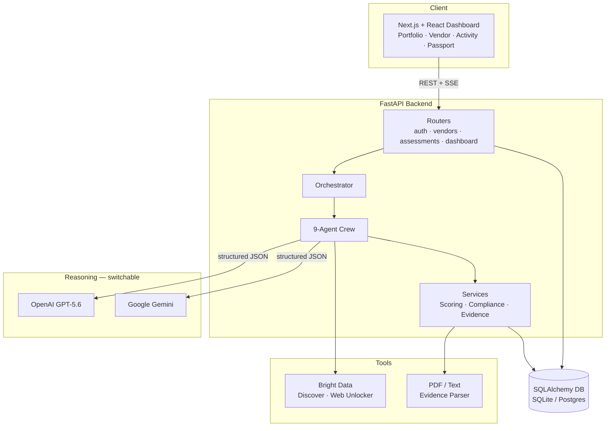
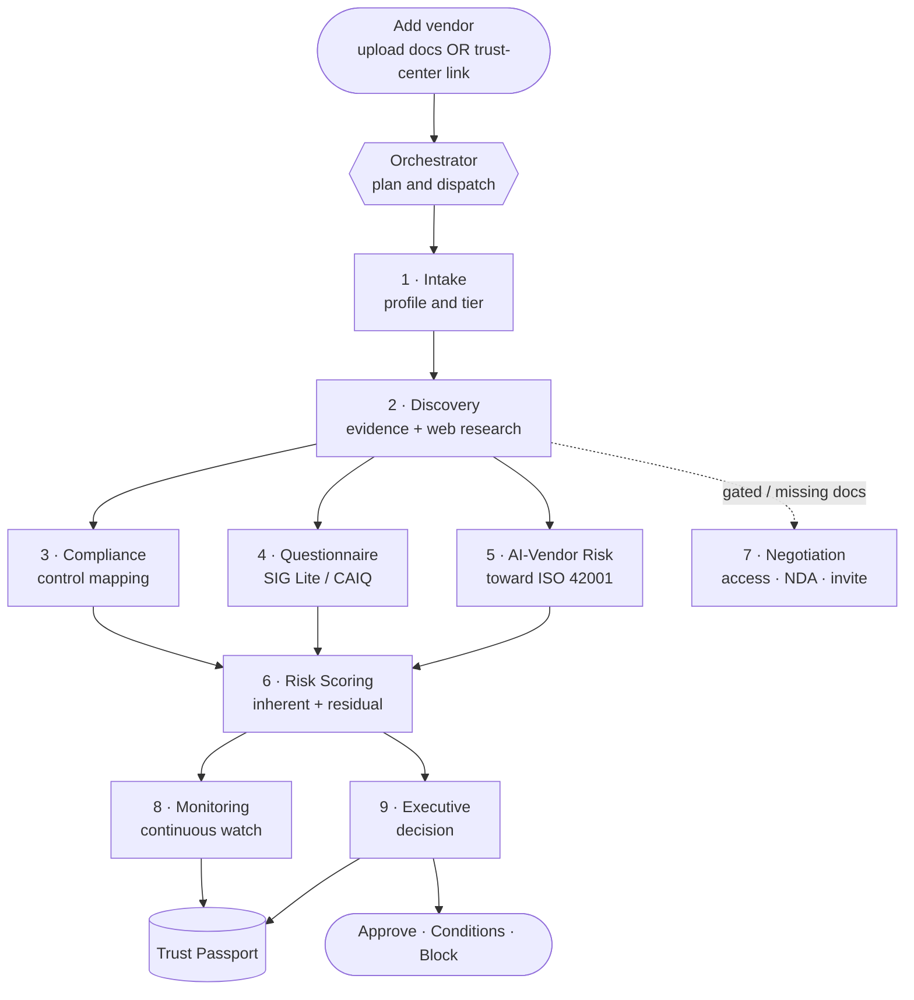
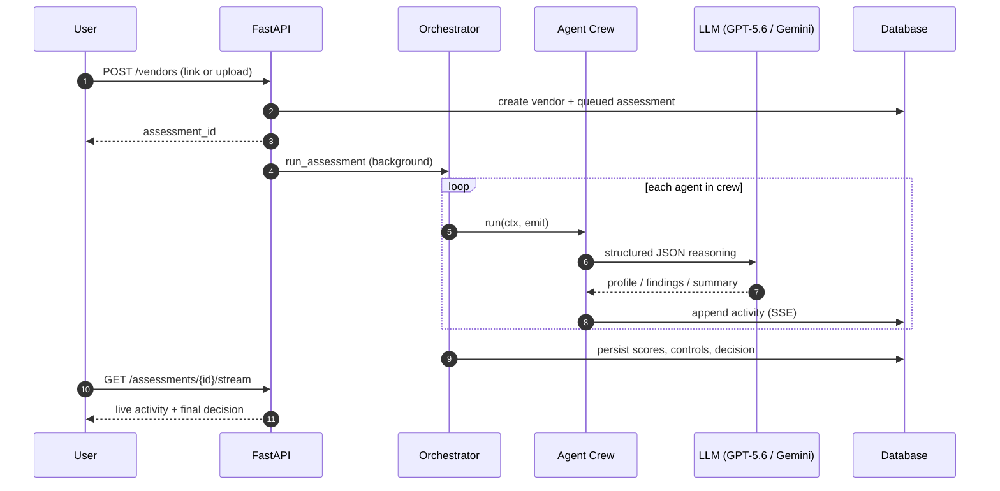
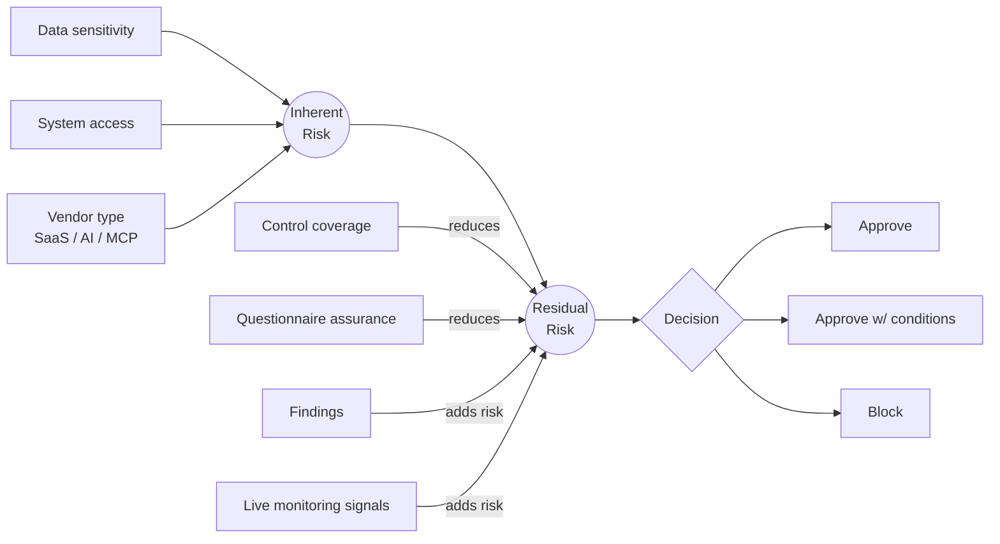
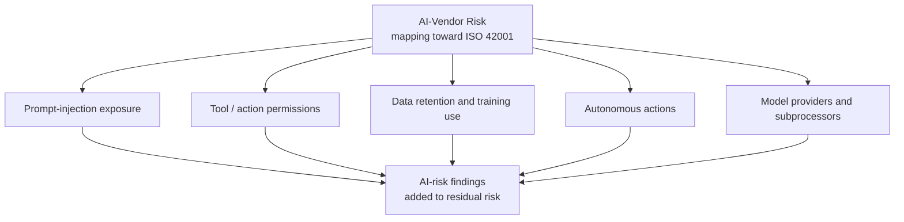
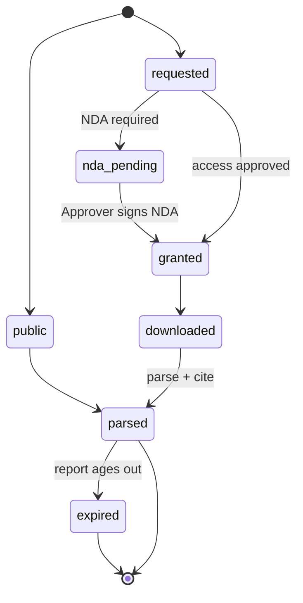
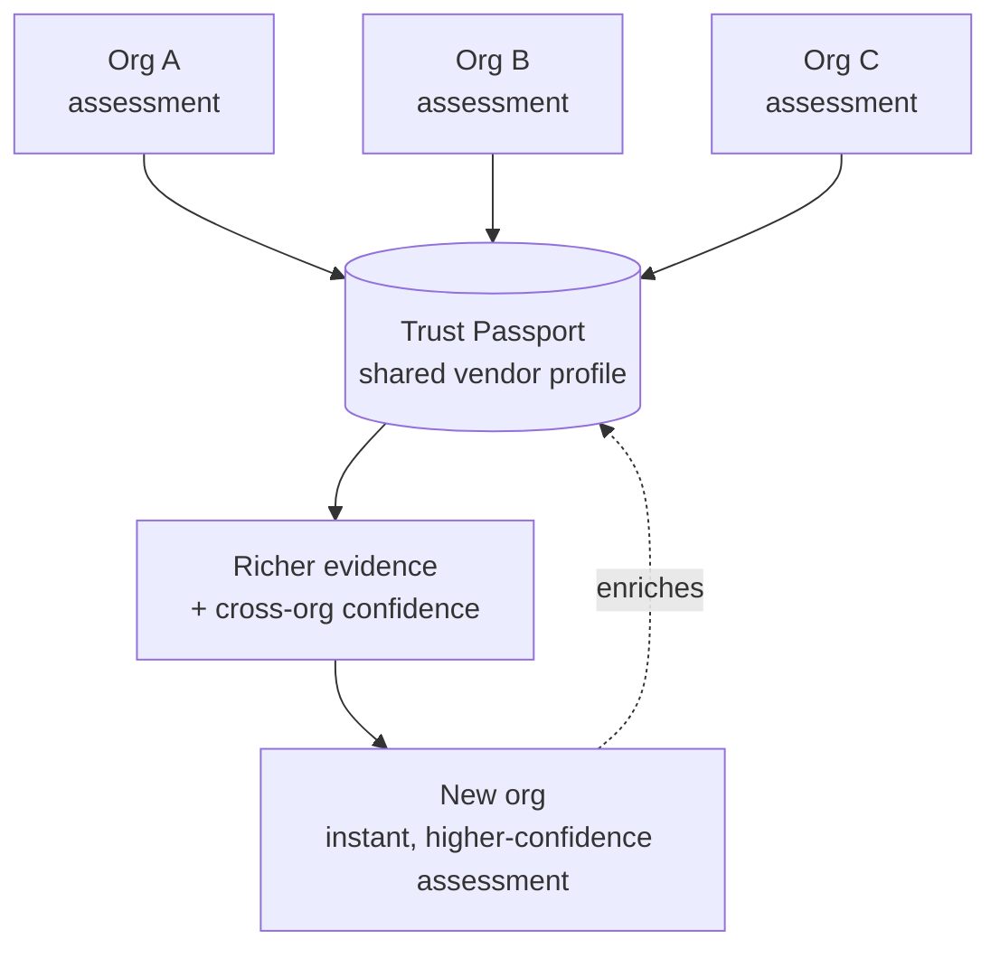

# Argus — Autonomous Third-Party Risk Management

> The all-seeing guardian. Say **"Assess Stripe"** and a crew of specialized agents
> autonomously ingests evidence, maps compliance, scores explainable residual risk,
> and produces a board-ready decision — then monitors the vendor forever.

Argus is a multi-tenant TPRM platform built for mid-market and AI-first companies
that have **no dedicated GRC/security-analyst team**. It turns vendor risk work —
normally weeks of spreadsheets and email chasing — into an autonomous workflow.

Built for **OpenAI Build Week** (Work & Productivity track), on top of the
open-source [`Studio1HQ/tprm-agent`](https://github.com/Studio1HQ/tprm-agent) (MIT).

---

## What makes it different

- **Real accounts & workspaces.** Sign up to create a company workspace (or use the
  demo account); every org's vendors and evidence are tenant-isolated, and every
  workspace API endpoint is bearer-token authenticated and role-gated.
- **Real evidence ingestion.** Upload SOC 2 / ISO / DPA files (PDF or text) — Argus
  parses them, detects the type, extracts issue/validity dates and the audit opinion,
  and cites the exact artifact behind every control result.
- **Evidence-based control mapping.** Each control is rated **Compliant / Partially
  compliant / No evidence / Gated (NDA pending) / Expired / N/A** with a citation and
  observation — the model real compliance agents (Vanta, CISO Assistant) use, plus
  `gated`/`expired` as Argus differentiators. Claims without evidence = non-compliant.
- **Live agent-crew flow.** A visible orchestration diagram lights up
  **pending → active → done** as the nine agents work, plus a streaming activity feed.
- **Real-time continuous monitoring.** A live residual-risk trend graph (auto-refreshing)
  tracks how a vendor's risk moves across assessments and monitoring signals.
- **An autonomous department, not a copilot.** Nine specialized agents operate like
  a real TPRM team (Intake, Discovery, Compliance, Questionnaire, AI-Vendor Risk,
  Risk Scoring, Negotiation, Monitoring, Executive).
- **First-class AI-vendor risk.** A dedicated module for AI tools / agents / MCP
  servers — prompt injection, tool permissions, data retention/training, autonomous
  actions — mapping toward **ISO 42001**. No incumbent treats this as core.
- **Solves the trust-center reality.** ~90% of trust centers gate SOC 2 / pen tests
  behind request-access + NDA. Argus ingests public content automatically, then
  routes NDAs to a human **Approver** (never auto-signs), and falls back to a
  **Trust Passport** vendor invite.
- **Trust Passport network effect.** Every assessment enriches a shared, cross-org
  vendor profile, so the Nth assessment is instant and higher-confidence.
- **Model-flexible & offline-safe.** Switch reasoning between **OpenAI GPT-5.6** and
  **Google Gemini** with one env var; with no keys, deterministic heuristics keep the
  whole product running and demoable.

---

## Tech stack

- **Backend:** Python 3.12 · FastAPI · SQLAlchemy (SQLite by default, Postgres-ready) ·
  multi-tenant model · SSE activity feed · a real PDF/text evidence parser (`pypdf`).
- **Frontend:** Next.js (App Router) · React · TypeScript — a dark security dashboard
  with the portfolio view, per-vendor deep-dive, live crew flow, real-time monitoring
  graph, and Trust Passport network.
- **Reasoning (switchable):** OpenAI **GPT-5.6** or Google **Gemini**, using structured
  (JSON) outputs, behind a single `complete_json()` abstraction with offline fallbacks.
- **Tools:** Bright Data — async **Discover API** for adverse-media discovery and the
  **Web Unlocker** for trust-center fetching (vendored from `Studio1HQ/tprm-agent`).

---

## Architecture & diagrams

> Interactive versions of all diagrams (with PNG/SVG export) live in
> [`diagrams.html`](./diagrams.html) — open it in a browser.

### 1. System architecture

Client dashboard → FastAPI backend → orchestrated crew → switchable LLM reasoning,
tools, and a multi-tenant database.



### 2. Autonomous agent-crew orchestration

The Orchestrator plans and dispatches nine specialized agents — like a real TPRM
department — from one input to a board-ready decision.



### 3. Assessment sequence (live)

One request kicks off a background crew that streams its work over SSE while
persisting explainable results.



### 4. Explainable scoring model

Inherent exposure is mitigated by verified controls and questionnaire assurance, and
aggravated by findings and live signals — every score ships with driver-level
explanations.



### 5. AI-vendor risk lens (ISO 42001)

A first-class risk dimension for AI tools, agents and MCP servers that no traditional
TPRM tool treats as core.



### 6. Evidence access-state lifecycle

Argus models the trust-center reality — ~90% of docs are gated — as a first-class
state machine, routing NDAs to a human Approver.



### 7. Trust Passport network effect

Every assessment across every org enriches a shared, evidence-cited vendor profile —
so the Nth assessment is instant and higher-confidence.



---

## Quickstart

### 1. Backend (port 8000)

```bash
cd backend
python3 -m venv .venv && source .venv/bin/activate
pip install -r requirements.txt
cp .env.example .env            # optional: set a provider + key (see Configuration)
uvicorn app.main:app --reload --port 8000
```

Health check: <http://127.0.0.1:8000/health> · API docs: <http://127.0.0.1:8000/docs>

The `/health` endpoint reports the active provider, e.g.:

```json
{ "status": "healthy", "llm_enabled": true, "llm_provider": "gemini",
  "llm_model": "gemini-3.5-flash", "bright_data_enabled": false }
```

### 2. Frontend (port 3000)

```bash
cd frontend
npm install
cp .env.local.example .env.local   # points at http://127.0.0.1:8000
npm run dev
```

Open <http://localhost:3000>.

> **Offline mode:** leave the keys blank and everything still works — try the built-in
> examples (Cursor, Stripe, Acme MCP). Add a provider + key to enable live reasoning.

---

## Configuration

All backend settings are environment variables (see [`backend/.env.example`](./backend/.env.example)).
Keep real keys only in `backend/.env` (gitignored) — never in `.env.example`.

| Variable | Default | Description |
| --- | --- | --- |
| `ARGUS_LLM_PROVIDER` | `openai` | Reasoning provider switch: `openai` or `gemini`. |
| `OPENAI_API_KEY` | — | OpenAI key (used when provider is `openai`). |
| `ARGUS_LLM_MODEL` | `gpt-5.6` | OpenAI model name. |
| `GEMINI_API_KEY` | — | Google AI Studio key (used when provider is `gemini`; starts with `AIza…`). |
| `ARGUS_GEMINI_MODEL` | `gemini-3.5-flash` | Gemini model name. |
| `BRIGHT_DATA_API_TOKEN` | — | Enables live discovery + web unlocking. |
| `BRIGHT_DATA_UNLOCKER_ZONE` | — | Web Unlocker zone (trust-center fetching). |
| `BRIGHT_DATA_SERP_ZONE` | — | Legacy SERP zone (kept for compatibility; Discover API needs only the token). |
| `DATABASE_URL` | `sqlite:///./argus.db` | SQLAlchemy URL; set a Postgres URL for production. |
| `ARGUS_PUBLIC_URL` | `http://localhost:3000` | Base URL for vendor-collaboration invite links. |
| `ARGUS_CORS_ORIGINS` | `http://localhost:3000` | Comma-separated allowed browser origins (never `*` with credentials). |
| `ARGUS_MAX_UPLOAD_FILES` | `10` | Max files per upload request. |
| `ARGUS_MAX_UPLOAD_BYTES` | `15728640` (15 MB) | Max bytes per uploaded file (parsed in memory). |

**Switch to Gemini:**

```bash
ARGUS_LLM_PROVIDER=gemini
GEMINI_API_KEY=AIza...          # from https://aistudio.google.com/apikey
ARGUS_GEMINI_MODEL=gemini-3.5-flash
```

> **Deployment baseline:** every workspace API endpoint requires a bearer token and
> role. Set `ARGUS_CORS_ORIGINS` to the deployed frontend origin, use Postgres, and set
> explicit upload limits before exposing the service outside a trusted environment.

---

## Demo script (< 3 minutes)

0. **Sign in** — create an account, or click **Use demo account** (`demo@acme.com` / `demo1234`).
1. **Portfolio** is empty. Click **Add vendor**.
2. **Cursor via trust-center link** (`https://trust.cursor.com/`): watch the crew flow
   light up live. Cursor is **SOC 2 Type II** certified (verified), so it gets a full,
   honest assessment — control coverage front and center → **approve with conditions**
   driven by the real AI data-flow risk (source code sent to model providers).
3. **Stripe via upload:** upload its compliance pack → Argus parses each file and cites
   it → high coverage → **approve**. Shows real evidence ingestion end-to-end.
4. **Acme MCP Connectors** (AI/MCP vendor): open the **AI Risk** tab — prompt-injection
   exposure, unscoped tool permissions, undisclosed retention, no third-party audit →
   **critical residual risk → BLOCK**. The "wow" no competitor demos.
5. **Upload evidence:** on any vendor's **Evidence** tab, upload a SOC 2 (PDF/text) →
   Argus re-assesses and the **Compliance** tab flips controls to *Compliant* with the
   cited artifact.
6. **Monitoring:** open the tab to see the **real-time residual-risk trend graph** and
   the continuous-monitoring feed (auto-refreshing).
7. **Agent Activity & Trust Passport:** watch the crew work across assessments live, and
   see each assessment enrich the shared vendor graph.

A full narrated video script is in [`docs/demo-video-script.md`](./docs/demo-video-script.md).

---

## Project layout

```
backend/app/
  agents/        # orchestrator + 9 crew agents
  compliance/    # framework control catalogs + questionnaires
  routers/       # auth, vendors, assessments, dashboard, activity, orgs
  tools/         # Bright Data discovery (Discover API) + access (Web Unlocker)
  data/          # curated demo vendor knowledge base (offline fallback)
  llm.py         # provider-switching LLM layer (OpenAI / Gemini)
  scoring.py     # inherent + residual scoring
  evidence.py    # PDF/text evidence parser
  services.py    # serialization + portfolio aggregation
frontend/app/    # Next.js dashboard (portfolio, vendor, activity, passport)
diagrams.html    # interactive architecture/flow diagrams (PNG/SVG export)
```

---

## How we built this with GPT-5.6

- **Reasoning at runtime:** the intake profiling, AI-risk analysis, and executive
  summary agents call an LLM through a single `complete_json()` abstraction, with a
  one-env-var switch between **OpenAI GPT-5.6** and **Google Gemini**, and deterministic
  fallbacks for offline reliability.
- **Foundation reuse:** the upstream `Studio1HQ/tprm-agent` Bright Data Discovery/Access
  tools were vendored and its linear `Discovery → Access → Action` pipeline was
  refactored into an orchestrated multi-agent crew.
- **Key design decisions:** the trust-center access strategy (never auto-sign NDAs;
  human Approver + vendor-invite fallback), the tiering + residual-scoring rubric, and
  the AI-vendor risk dimensions.

See [`SUBMISSION.md`](./SUBMISSION.md) for the Devpost checklist and
[`docs/YC_APPLICATION.md`](./docs/YC_APPLICATION.md) for the startup narrative.

---

## Attribution & license

Built on top of [`Studio1HQ/tprm-agent`](https://github.com/Studio1HQ/tprm-agent)
(MIT). The vendored, adapted files (`backend/app/tools/discovery.py`,
`backend/app/tools/access.py`, `backend/app/config.py`) note their origin in-file.
All multi-tenant platform, agent crew, compliance engine, scoring, trust-center
handling, Trust Passport, and UI code is new work created during the hackathon.

MIT License.
