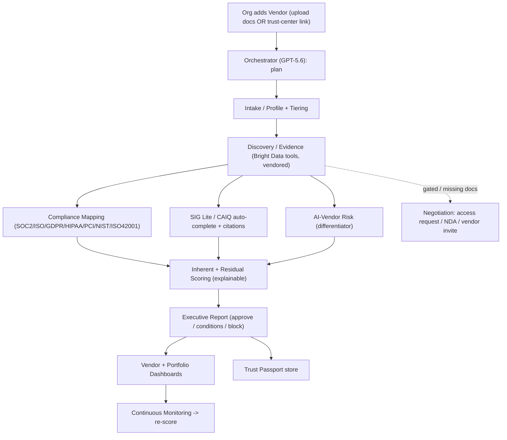

# Argus — Autonomous Third-Party Risk Management

> The all-seeing guardian. Say **"Assess Stripe"** and a crew of specialized agents
> autonomously ingests evidence, maps compliance, scores explainable residual risk,
> and produces a board-ready decision — then monitors the vendor forever.

Argus is a multi-tenant TPRM platform built for mid-market and AI-first companies
that have **no dedicated GRC/security-analyst team**. It turns vendor risk work —
normally weeks of spreadsheets and email chasing — into an autonomous workflow.

Built for **OpenAI Build Week** (Work & Productivity track), on top of the
open-source [`Studio1HQ/tprm-agent`](https://github.com/Studio1HQ/tprm-agent) (MIT).

---

## What makes it different

- **Real accounts & workspaces.** Sign up to create a company workspace (or use the
  demo account); every org's vendors and evidence are tenant-isolated.
- **Real evidence ingestion.** Upload SOC 2 / ISO / DPA files (PDF or text) — Argus
  parses them, detects the type, extracts issue/validity dates, and cites the exact
  artifact behind every control result.
- **Evidence-based control mapping.** Each control is rated **Compliant / Partially
  compliant / No evidence / Gated (NDA pending) / Expired / N/A** with a citation and
  observation — the model real compliance agents (Vanta, CISO Assistant) use, plus
  `gated`/`expired` as Argus differentiators. Claims without evidence = non-compliant.
- **Live Agent Activity tab.** Watch the whole crew work across every assessment in
  real time.
- **An autonomous department, not a copilot.** Nine specialized agents operate like
  a real TPRM team (Intake, Discovery, Compliance, Questionnaire, AI-Vendor Risk,
  Risk Scoring, Negotiation, Monitoring, Executive).
- **First-class AI-vendor risk.** A dedicated module for AI tools / agents / MCP
  servers — prompt injection, tool permissions, data retention/training, autonomous
  actions — mapping toward **ISO 42001**. No incumbent treats this as core.
- **Solves the trust-center reality.** ~90% of trust centers gate SOC 2 / pen tests
  behind request-access + NDA. Argus ingests public content automatically, then
  routes NDAs to a human **Approver** (never auto-signs), and falls back to a
  **Trust Passport** vendor invite.
- **Trust Passport network effect.** Every assessment enriches a shared, cross-org
  vendor profile, so the Nth assessment is instant and higher-confidence.

---

## Architecture



- **Backend:** Python / FastAPI, SQLAlchemy (SQLite by default, Postgres-ready),
  multi-tenant model, SSE-friendly activity feed. Reasoning via **GPT-5.6** (OpenAI).
- **Frontend:** Next.js (App Router) dark security dashboard — portfolio view, deep
  per-vendor dashboard, live crew activity feed, Trust Passport network.
- **Runs fully offline.** With no API keys, Argus uses deterministic heuristics and a
  curated vendor knowledge base so the whole product demos without external services.

---

## Quickstart

### 1. Backend (port 8000)

```bash
cd backend
python3 -m venv .venv && source .venv/bin/activate
pip install -r requirements.txt
cp .env.example .env            # optional: add OPENAI_API_KEY / Bright Data keys
uvicorn app.main:app --reload --port 8000
```

Health check: <http://127.0.0.1:8000/health> · API docs: <http://127.0.0.1:8000/docs>

### 2. Frontend (port 3000)

```bash
cd frontend
npm install
cp .env.local.example .env.local   # points at http://127.0.0.1:8000
npm run dev
```

Open <http://localhost:3000>.

> **Offline mode:** leave the keys blank and everything still works — try the built-in
> examples (Stripe, Cursor, Acme MCP). Add `OPENAI_API_KEY` + `ARGUS_LLM_MODEL=gpt-5.6`
> and Bright Data keys to enable live GPT-5.6 reasoning and real web research.

---

## Demo script (< 3 minutes)

0. **Sign in** — create an account, or click **Use demo account** (`demo@acme.com` / `demo1234`).
1. **Portfolio** is empty. Click **Add vendor**.
2. **Cursor via trust-center link** (`https://trust.cursor.com/`): watch the crew work
   live. It detects the Vanta trust center, sees the SOC 2 is **NDA-gated**, so control
   coverage can't be verified → **critical residual risk → BLOCK**, with an NDA routed
   to an Approver. This is the trust-center reality in one shot.
3. **Stripe via upload:** full compliance pack → high coverage → **medium residual →
   approve-with-conditions** at Tier 1. Shows the contrast when evidence is accessible.
4. **Acme MCP Connectors** (AI/MCP vendor): open the **AI Risk** tab — prompt-injection
   exposure, unscoped tool permissions, undisclosed retention. The "wow" no competitor demos.
5. **Upload evidence:** on any vendor's **Evidence** tab, upload a SOC 2 (PDF/text) →
   Argus parses it, re-assesses, and the **Compliance** tab flips controls to
   *Compliant* with the cited artifact.
6. **Agent Activity:** open the tab to watch the crew work across assessments live.
7. **Trust Passport Network:** each assessment enriched the shared graph.

---

## How we built this with Codex + GPT-5.6

This project was designed and implemented in collaboration with **OpenAI Codex**.

- **Product & architecture:** we used Codex to pressure-test the idea against the
  competitive landscape (SecureOS, Vanta, Zip), which shaped the sharp wedge —
  un-served mid-market + AI-vendor risk + Trust Passport network — instead of a clone.
- **Foundation reuse:** Codex analyzed the upstream `Studio1HQ/tprm-agent` and
  vendored its Bright Data Discovery/Access tools, then **refactored the linear
  `Discovery → Access → Action` pipeline into an orchestrated multi-agent crew**.
- **Codex accelerated:** the SQLAlchemy multi-tenant schema, the nine agent modules,
  the framework/questionnaire compliance engine, the explainable scoring model, the
  FastAPI routers + SSE activity feed, and the entire Next.js dashboard UI.
- **Key human decisions:** the trust-center access strategy (never auto-sign NDAs;
  human Approver + vendor-invite fallback), the tiering + residual-scoring rubric, and
  the AI-vendor risk dimensions were product/engineering calls we made and Codex implemented.
- **GPT-5.6** powers the reasoning agents at runtime (intake profiling, AI-risk
  analysis, executive summary), with deterministic fallbacks for offline reliability.

See [`SUBMISSION.md`](./SUBMISSION.md) for the Devpost checklist and
[`docs/YC_APPLICATION.md`](./docs/YC_APPLICATION.md) for the startup narrative.

---

## Attribution & license

Built on top of [`Studio1HQ/tprm-agent`](https://github.com/Studio1HQ/tprm-agent)
(MIT). The vendored, adapted files (`backend/app/tools/discovery.py`,
`backend/app/tools/access.py`, `backend/app/config.py`) note their origin in-file.
All multi-tenant platform, agent crew, compliance engine, scoring, trust-center
handling, Trust Passport, and UI code is new work created during the hackathon.

MIT License.
